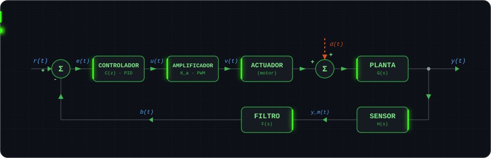

<div align="center">
  
</div>

<br/>

## 📁 Sobre mí

<div align="center">


</div>

```
sobre-mi/
├── fundamentos/
│   ├── mecatronica.md            → Último año, Ingeniería en Mecatrónica — Universidad Nacional de Cuyo
│   ├── lenguajes.md              → Python, C, C++, MATLAB — la lógica importa más que la sintaxis
│   ├── simulink.md               → Modelado de sistemas dinámicos y simulaciones realistas antes del hardware
│   └── arquitectura.md           → POO: capas de abstracción entre el hardware y la experiencia de usuario
├── areas-de-interes/
│   ├── control-y-electronica.md  → Sistemas realimentados, anti-aliasing, electrónica de control
│   ├── robotica-y-vision.md      → Path planning, computer vision, ML/DL — forward y backpropagation
│   ├── cinematica-y-dinamica.md  → Cinemática de robots consolidada; profundizando en dinámica
│   └── iot-y-redes.md            → IoT, Industria 4.0, redes de comunicación — foco de crecimiento actual
├── trabajo-actual/
│   └── data-annotation.md        → Data annotation para entrenamiento de modelos de IA
├── ahora-mismo/
│   ├── brazo-teleoperado.md 🔒   → Control por teleoperación de un brazo robótico didáctico
│   ├── primer-producto.md 🔒     → De proyectos académicos a un producto real: primera vez con ML, CV y path-planning
│   ├── control-discreto.md       → Aprendiendo
│   └── realidad-virtual.md       → Aprendiendo
└── vision/
    └── solarpunk.md              → Robótica + energías verdes al servicio de soluciones reales, sin utopías
```

<p align="center"><sub>🇦🇷 Español (nativo) · 🇺🇸 English (professional working proficiency)</sub></p>
